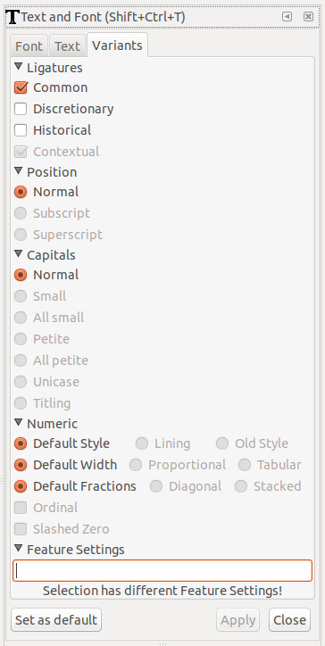
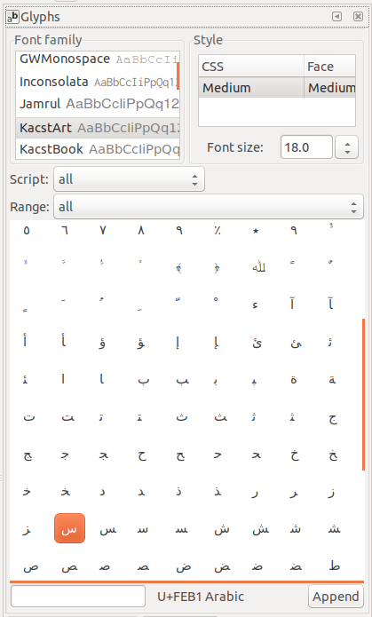
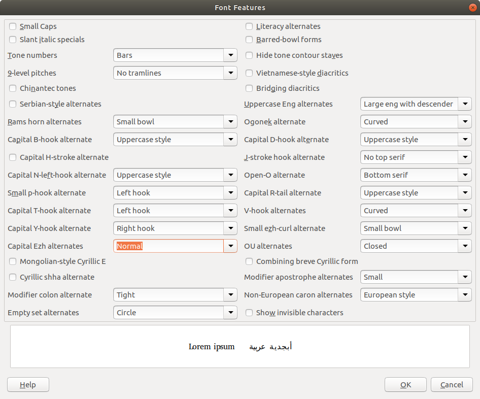
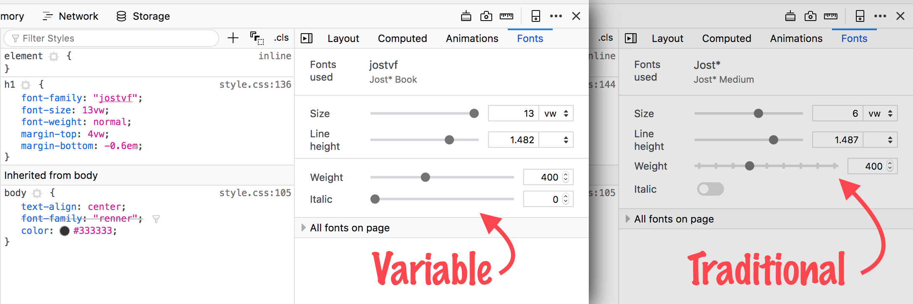

# Smart-font features #

This document records user-interface work to provide access to
smart-font features. 

**Contents**

  - [Scribus](#scribus)
  - [Inkscape](#inkscape)
  - [LibreOffice](#libreoffice)
  - [Firefox](#firefox)
  - [GTK+ Font Explorer](#gtk-font-explorer)
  

## Scribus ##

Scribus is a desktop-publishing (DTP) application built with the Qt
application framework. As of [version
1.5.3](https://wiki.scribus.net/canvas/1.5.3_Release) from December
2016, the `Text Properties` palette includes controls for activating
**OpenType** smart-font features.

In addition, Scribus supports complex script-shaping features. The
project wiki provides details on a per-script basis and examples:
https://wiki.scribus.net/canvas/Complex_Script_Functionality

## Inkscape ##

Inkscape is a cross-platform vector-graphics editor built with the
GTK+ application framework. As of version 0.92, the _Variants_ tab of
the "Text and Font" palette provides controls for manipulating a small
set of common **OpenType** smart-font features:

    Common ligatures (`liga`)
	Discretionary ligatures (`dlig`)
	Historical ligatures (`hlig`)
	Contextual ligatures (`clig`)
	Subscripts (`subs`)
	Superscripts (`sups`)
	Small capitals (`smcp` and `c2sc`)
	Petite capitals (`pcap` and `c2pc`)
	Unicase forms (`unic`)
	Titling forms (`titl`)
	Lining and Oldstyle numerals (`lnum` and `onum`)
	Proportional and tabular widths (`pnum` and `tnum`)
	Fraction styles (`frac` and `afrc`)
	Ordinals (`ordn`)
	Slashed zero (`zero`)

> Note: The Inkscape interface does not show the four-letter feature
> tags listed in parentheses, only the human-readable names.

In addition, users can enter CSS-like syntax into the "Feature
Settings" entry widget to further specify smart-font features.

The _Variants_ tab presents the features above in a fixed order,
separated into four groups ("Ligatures","Position","Capitals", and
"Numeric").

  - The features under "Ligatures" are toggleable with
	checkboxes. 
  - The features under "Position" are presented as a single
	radio-button selection: 'Normal', 'Subscript', and 'Superscript' are
	mutually exclusive.
  - The features under "Capitals" are presented as a single
	radio-button selection: 'Normal', 'Small', 'All small', 'Petite',
	'All petite', 'Unicase', and 'Titling' are mutually exclusive.
  - The features under "Numeric" are further subdivided. 'Default
    style', 'Lining' and 'Old Style' are one mutually-exclusive
    radio-button selection. 'Default Width', 'Proportional', and
    'Tabular' are one mutually-exclusive radio-button
    selection. 'Default Fractions', 'Diagonal', and 'Stacked' are one
    mutually-exclusive radio-button selection. "Ordinal" is a separate
    checkbox. "Slashed Zero" is a separate checkbox.

There is no preview of the effects of changing the smart-font feature settings.

The "Glyphs" palette provides a grid of all glyphs
available in the selected font, akin to the functionality of the
`aalt` feature.

Version 0.93, which has not yet been released but is available in
nightly builds, expands the set of smart-font features supported and
provides a different interface.

## LibreOffice ##

LibreOffice is a cross-platform office suite that includes a word
processor and presentation builder (among other components). As of
[version
5.3.0](https://wiki.documentfoundation.org/ReleaseNotes/5.3#Text_Layout)
from February 2017, it supports activating **OpenType** and
**Graphite** smart-font features by appending a CSS-like syntactic
expression to the name of the active font in the Font drop-down
selector. For example,

    Cardo:ss01&tnum
	
activates stylistic set #1 (`ss01`) and enables tabular numerals
(`tnum`) in the _Cardo_ font.

Version 6.2.0, which has not yet been released but is available in
nightly builds, adds a graphical interface to select and configure all
available smart-font features. Issue
[58941](https://bugs.documentfoundation.org/show_bug.cgi?id=58941) on
the LibreOffice bug tracker follows the progress of this
implementation work. This screenshot is from the bug tracker:

The dialog includes checkboxes for on/off features and drop-down
selectors for features that have more than a simple on/off setting. 

Feature labels are taken from the active font.

The features are ordered in the dialog box in the order that they are
encountered in the font binary.

A single sample-text string is shown.

## Firefox ##

Firefox is a cross-platform web browser. It supports the standard CSS
syntax for expressing smart-font features in web-page content.

As of version 63, which has not yet been released to the stable
channel, it features a
[font-editor](https://developer.mozilla.org/en-US/docs/Tools/Page_Inspector/How_to/Edit_fonts)
tab in the Page Inspector. Modifying the settings in the tab affects
the active web page.

The font-editing tab does not currently offer controls for
manipulating smart-font features, but it does offer controls for
manipulating [variable-font](variable-fonts.md#firefox) axes. However,
users can manipulate **OpenType** and **Graphite** smart-font features
in the Page Inspector by directly editing the page's CSS rules.

This screenshot is from the Mozilla Hacks [blog
post](https://hacks.mozilla.org/2018/09/variable-fonts-arrive-in-firefox-62/)
by Dan Callahan about variable-font support:

## GTK+ Font Explorer ##

GTK+ is an application platform and widget toolkit developed with the
GNOME desktop project for Linux.

GTK+ Font Explorer is the standard font-selection widget provided as
of the GTK+ 3.24 release from September 2018.

The interface provides set of controls for previewing the available
**OpenType** features in the currently-chosen font, as well as
adjusting the settings of any
[variable-font](variable-fonts.md#gtk-font-explorer) axes. 
